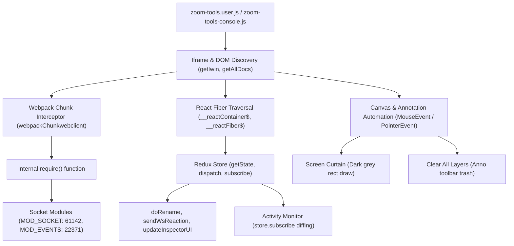

# 🧠 Zoom Web Tools — Техническая архитектура и руководство для разработчиков (AI & Human)

> Этот документ описывает внутреннее устройство скрипта **Zoom Web Tools**, методы перехвата внутренних механизмов Zoom Web Client (`app.zoom.us`), а также содержит инструкции и промпты для работы с нейросетями (Claude, ChatGPT, DeepSeek), если вы захотите доработать, расширить или модифицировать этот проект.

---

## 📐 1. Обзор архитектуры

Скрипт написан на чистом нативном JavaScript (ES6+) без внешних зависимостей и сборщиков. Он исполняется непосредственно в контексте страницы веб-клиента Zoom.



---

## 🔬 2. Ключевые точки внедрения в Zoom Web Client

### 2.1. Мультифреймовый поиск (Iframe Traversal)
Zoom Web может монтировать своё приложение как в корневом `window`, так и внутри `iframe#webclient` или нескольких вложенных фреймов:
* Функция `getIwin()` обходит все дочерние фреймы, `document.getElementById('webclient')` и `window.parent`, проверяя наличие глобального объекта `webpackChunkwebclient` или селектора `#root`.
* Функция `getAllDocs()` собирает массив документов всех фреймов для надёжного поиска кнопок и холста аннотаций.

### 2.2. Перехват Webpack-рантайма
Вместо monkey-patching сетевых запросов `fetch` или `XMLHttpRequest`, скрипт получает прямой доступ к внутренним модулям Zoom через официальный API Webpack:
```javascript
const getReq = iwin => {
  for (const w of [iwin, window]) {
    if (w?.webpackChunkwebclient) {
      let r = null;
      try {
        w.webpackChunkwebclient.push([[Symbol()], {}, x => { r = x; }]);
        if (r) return r;
      } catch {}
    }
  }
  return null;
};
```
С помощью полученной функции `req(moduleId)` скрипт подключается к закрытым модулям:
* `MOD_SOCKET = 61142` — модуль сокетов (создание действий `ac({ evt, body })`).
* `MOD_EVENTS = 22371` — константы событий сокета (например, `WS_CONF_RENAME_REQ` для смены ника).

### 2.3. Поиск Redux Store через React Fiber
Для чтения актуального состояния конференции (список участников, темы, пароли) скрипт находит Redux Store через дерево React Fiber:
```javascript
function findStoreInWindow(w) {
  // Обход корневых элементов #root, #app-root, body
  // Поиск свойств __reactContainer$... или __reactFiber$...
  // Проход вверх по node.return до объекта с memoizedProps.store
}
```
Найденный `store` предоставляет:
* `store.getState()`:
  * `state.attendeesList.attendeesList` — список участников, их статусы микрофонов, камер, поднятых рук и признак организатора (`isHost`).
  * `state.meeting` — тема митинга, `password` / `pwd` (пароль), Meeting ID, политики комнаты (`meetingPolicy`).
* `store.dispatch(action)` — отправка внутренних событий.
* `store.subscribe(fn)` — живая реакция на любые изменения в митинге.

### 2.4. Автоматизация холста аннотаций (Завеса и Очистка)
* **Завеса (`runStora`)**: Программно активирует инструмент прямоугольника и цвет Dark grey, после чего эмулирует события мыши (`pointerdown`, `mousemove`, `pointerup`) на верхнем прозрачном холсте Zoom Canvas (`.upper-canvas`), заливая видимую область демонстрации.
* **Очистка (`clearAllAnno`)**: Находит нативную кнопку корзины в панели аннотаций Zoom (`[class*="anno-toolbar__item--clear"]`) и эмулирует клик с выбором «Очистить все рисунки».
* **Жизненный цикл холста и ограничения:**
  * **Зависимость от прав хоста:** Элемент `.upper-canvas` создается клиентом Zoom только в том случае, если в настройках безопасности конференции хост разрешил комментирование (`policies.canAnnotate`). Если хост заблокировал аннотации, холст отсутствует в DOM, и скрипт выдаёт предупреждение.
  * **Таймаут неактивности:** Если демонстрация неподвижна в течение нескольких минут, Zoom переводит холст в энергосберегающий режим (unmount/sleep). Скрипт отправляет события `pointerenter` и `wheel` для пробуждения, однако при полном засыпании требуется активность пользователя над областью демонстрации.

### 2.5. Двуязычная локализация на лету (Bilingual Engine)
Скрипт использует реактивный хелпер:
```javascript
let _ztLang = sessionStorage.getItem('zt_lang') || 'ru';
const T = (ru, en) => (_ztLang === 'en' ? en : ru);
```
При нажатии кнопки `🌐 RU / EN` значение в `sessionStorage` обновляется, и вызывается `buildWidget()`. Все тексты, кнопки, логгеры и тултипы мгновенно перерисовываются на выбранный язык без перезагрузки вкладки.

### 2.6. Горячая перезагрузка (Hot-Reload)
В начале выполнения скрипт проверяет наличие `window.__zt_cleanup`:
```javascript
if (typeof window.__zt_cleanup === 'function') {
  try { window.__zt_cleanup(); } catch {}
}
```
Хук очистки останавливает все активные `setInterval`, отписывается от `store.subscribe` и удаляет старый DOM виджета, что позволяет вставлять новые версии скрипта прямо в открытую вкладку.

---

## 🤖 3. Руководство для нейросетей (Prompting Claude / GPT / DeepSeek)

Если вы работаете над доработкой скрипта в связке с AI-ассистентом, используйте следующие рекомендации и шаблон вводного контекста (System Context).

### 3.1. Шаблон контекста для нейросети (скопируйте в диалог с LLM)

```text
Ты опытный JavaScript reverse-engineer и фронтенд-разработчик.
Мы модифицируем скрипт Zoom Web Tools — userscript / консольный инструмент для веб-версии Zoom (app.zoom.us).

Ключевые правила проекта:
1. Только чистый Vanilla JS (ES6+), без сторонних библиотек, без JSX, без npm-пакетов.
2. Скрипт выполняется в браузере. Он находит Redux Store через React Fiber (__reactFiber$) и Webpack require через window.webpackChunkwebclient.
3. Любые пользовательские строки должны быть обернуты в хелпер локализации T(ru, en):
   Пример: title="${T('Мой текст', 'My text')}"
4. Для консольной версии zoom-tools-console.js не должно быть однострочных комментариев //, чтобы код не ломался при вставке в F12.
5. Любые новые таймеры должны регистрироваться и очищаться в функции window.__zt_cleanup.
6. Константы сокетов: MOD_SOCKET = 61142, MOD_EVENTS = 22371.

Задача: [Опишите здесь вашу задачу, например: "добавь кнопку спама эмодзи сердечка с интервалом 50мс"]
```

### 3.2. Примеры типовых задач для ИИ

#### Пример 1: Добавление новой реакции или эмодзи
> *Промпт:* «В секцию 4 (Спам эмодзи) добавь быстрый пресет для эмодзи 🚀 (Ракета) и сделай хоткей `Alt+R` для его быстрого запуска. Обязательно добавь английский и русский перевод для кнопки и тултипа».

#### Пример 2: Добавление нового поля в Инспектор митинга
> *Промпт:* «Посмотри функцию `getMeetingInspectorData(store, iwin)`. Добавь считывание параметра `isBreakoutRoomActive` из стейта Redux и выведи в UI инспектора строчку с индикатором: зелёный если сессионные залы не используются, жёлтый если активны».

#### Пример 3: Создание нового кастомного фильтра для логов
> *Промпт:* «В Секции 5 (Мониторинг) добавь чекбокс для фильтрации лога поднятия рук (`zt-flt-hand`), чтобы при снятой галочке события поднятия рук не засоряли окно лога, но счётчик в шапке продолжал учитываться».

---

## ⚠️ 4. Безопасность и стабильность

1. **Не вызывайте приватные API в цикле без задержки:** WebSocket Zoom имеет rate limit (ограничение частоты). Минимальный безопасный интервал для спама эмодзи составляет 20–50 мс, для поднятия руки — 150–250 мс.
2. **Не мутируйте стейт Redux напрямую:** используйте только `store.dispatch(action)`. Прямая мутация `store.getState().xxx = yyy` сломает React Fiber reconciliation и приведёт к белому экрану (React Error Boundary).
3. **Храните данные сессии в `sessionStorage`:** не используйте `localStorage` для хранения временных ников или идентификаторов, чтобы не засорять хранилище браузера между разными конференциями.

---

## 🔄 5. Что делать, если Zoom обновился и сменились ID модулей

При сборке новых релизов веб-клиента Zoom Webpack переиндексирует внутренние модули. Из-за этого константы `MOD_SOCKET` (по умолчанию `61142`) и `MOD_EVENTS` (по умолчанию `22371`) могут получить новые числовые номера.

Если после очередного обновления Zoom перестала работать отправка реакций или моментальная смена ника:

### Автоматический поиск новых ID через консоль:
1. Зайдите в митинг Zoom через браузер и откройте консоль (`F12`).
2. Вставьте и выполните эту короткую команду:

```javascript
(() => {
  let r = null;
  for (const w of [document.getElementById('webclient')?.contentWindow, window]) {
    if (w?.webpackChunkwebclient) {
      try { w.webpackChunkwebclient.push([[Symbol()], {}, x => { r = x; }]); if (r) break; } catch {}
    }
  }
  if (!r) { console.error('Webpack не найден'); return; }

  const ids = Object.keys(r.c || r.m || {});
  let foundSocket = null, foundEvents = null;
  for (const id of ids) {
    try {
      const m = r(id);
      if (m && typeof m === 'object') {
        if (m.WS_CONF_RENAME_REQ && m.WS_CONF_SEND_REACTION_REQ) foundEvents = id;
        if (typeof m.h === 'function' && (m.default || Object.keys(m).length <= 4)) foundSocket = id;
      }
    } catch {}
  }
  console.log(`%c[ZT Discovery] Актуальные ID модулей:\nconst MOD_SOCKET = ${foundSocket};\nconst MOD_EVENTS = ${foundEvents};`, 'color:#10b981;font-weight:bold;font-size:13px');
})();
```

3. Команда выведет актуальные ID (например, `const MOD_SOCKET = 12345; const MOD_EVENTS = 67890;`).
4. Замените две строчки в начале файла скрипта — и всё снова заработает!
